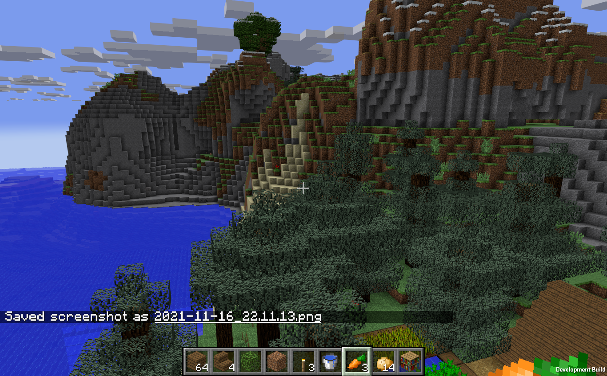
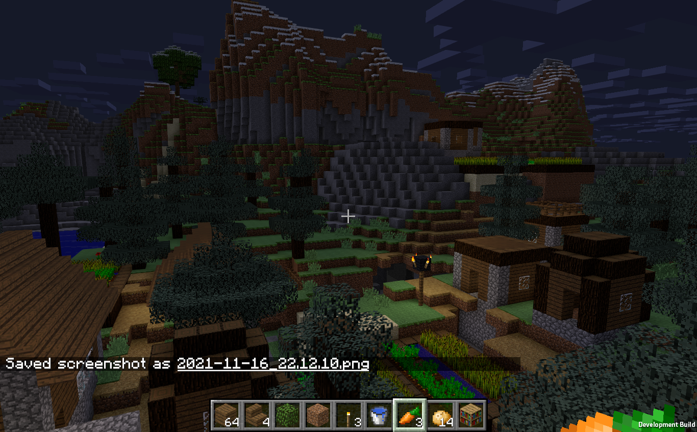

## Theircraft

This is a Unity project I made to recreate some features in Minecraft.

All resources are from Minecraft and owned by Mojang.

I use library from [NBTExplorer](https://github.com/jaquadro/NBTExplorer) to read/write Minecraft saves.

Terrain generation has not been implemented yet.

### Versions

Unity Version: Unity 2021.1.12f1c1

Compatible Minecraft Version: Minecraft 1.12

### Features

* CPU Ambient Occlusion
* CPU Lighting
* Clouds
* Day-Night Cycle
* Crafting
* Stairs
* Slab
* Door
* Fence
* Wall
* Torch
* Ladder
* Tools (Axe, Pickaxe)

### Controls

* WASD to move.
* W twice to run.
* Space to jump.
* Left click to destroy block.
* Right click to place block.
* 1-9 to select blocks.
* Scrollwheel to cycle through blocks.
* E to open inventory.
* ESC to open menu.
* T to type text into chat.
* Forward slash (/) to enter command.
* Space twice to fly (in creative mode).
* F2 to take screenshot.

### Chat Commands

    /time <value>

Set current time.

    /gamemode <mode>

Change game mode.

    /kill

Suicide.

    /zombie

Summon a zombie.

### Run

Add "client" folder to your Unity Hub, and open the project.

Open "Scenes/StartScene.unity" and run.

### Contributing

Feel free to make contribution to this project.

It can be new features, bug fixes, performance optimizations or better namings, etc.

### Screenshots

